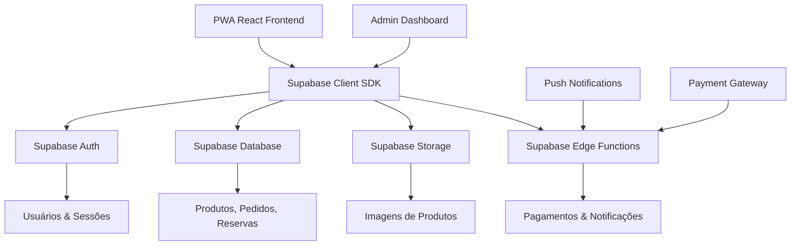

# Análise Técnica Profunda - App Q Delícia

## 1. Visão Geral do Projeto

O **Q Delícia** é um Progressive Web App (PWA) desenvolvido em React + TypeScript para delivery de uma panificadora especializada em frangos assados e churrascos. O projeto atual possui uma arquitetura frontend robusta com dados mockados, pronto para evolução para um sistema completo com backend.

### Características Atuais
- **Frontend**: React 19.1.0 + TypeScript + Vite
- **Styling**: TailwindCSS com tema customizado
- **Estado**: Context API com useReducer
- **Dados**: Completamente mockados com Faker.js
- **Funcionalidades**: Sistema completo de pedidos, carrinho, agendamento, pagamento e painel administrativo

## 2. Análise da Arquitetura Atual

### 2.1 Pontos Fortes

#### Estrutura Bem Organizada
```
src/
├── components/          # Componentes organizados por domínio
│   ├── Admin/          # Painel administrativo
│   ├── Common/         # Componentes reutilizáveis
│   ├── Layout/         # Layout e navegação
│   └── Views/          # Páginas principais
├── context/            # Gerenciamento de estado global
├── data/              # Dados mockados
├── types/             # Definições TypeScript
└── config.ts          # Configurações da aplicação
```

#### Gerenciamento de Estado Eficiente
- Context API bem estruturado com actions tipadas
- Estado centralizado para carrinho, usuário, pedidos e reservas
- Reducer pattern para operações complexas

#### Tipagem Completa
- Interfaces bem definidas para Product, Order, User, Reservation
- Tipos específicos para diferentes categorias de produtos
- Enums para status e estados

#### Funcionalidades Implementadas
1. **Sistema de Produtos**: Frangos, churrascos, adicionais, bolos
2. **Carrinho de Compras**: Adicionar, remover, atualizar quantidades
3. **Agendamento**: Horários de retirada com validação
4. **Sistema de Pagamento**: PIX e cartão (mockado)
5. **Reservas**: Sistema para eventos corporativos e familiares
6. **Painel Admin**: Dashboard, pedidos, reservas
7. **Autenticação**: Login básico com diferentes níveis de acesso

### 2.2 Pontos de Melhoria

#### Limitações Atuais
1. **Dados Temporários**: Tudo em memória, perdido ao recarregar
2. **Sem Persistência**: Carrinho e estado não persistem
3. **Autenticação Simulada**: Login sem validação real
4. **Pagamentos Mockados**: Sem integração real
5. **Sem Notificações**: Push notifications ausentes
6. **Sem Sincronização**: Dados não sincronizam entre dispositivos

#### Oportunidades de Refatoração
1. **App.tsx (241 linhas)**: Muito extenso, precisa ser modularizado
2. **Navegação**: Implementar React Router para URLs amigáveis
3. **Validações**: Adicionar validação robusta de formulários
4. **Error Handling**: Implementar tratamento de erros global
5. **Loading States**: Adicionar estados de carregamento

## 3. Estratégia de Migração para Supabase

### 3.1 Por que Supabase?

**Vantagens para o Q Delícia:**
- **Backend-as-a-Service**: Reduz complexidade de infraestrutura
- **PostgreSQL**: Banco relacional robusto
- **Auth Built-in**: Sistema de autenticação completo
- **Real-time**: Sincronização automática de dados
- **Storage**: Para imagens de produtos
- **Edge Functions**: Para lógica de negócio complexa
- **Mobile-First**: Otimizado para PWAs

### 3.2 Arquitetura Proposta



### 3.3 Modelo de Dados Supabase

#### Tabelas Principais

```sql
-- Usuários (extends Supabase Auth)
CREATE TABLE profiles (
    id UUID REFERENCES auth.users(id) PRIMARY KEY,
    name TEXT NOT NULL,
    phone TEXT,
    role TEXT DEFAULT 'customer' CHECK (role IN ('customer', 'admin')),
    created_at TIMESTAMP WITH TIME ZONE DEFAULT NOW(),
    updated_at TIMESTAMP WITH TIME ZONE DEFAULT NOW()
);

-- Produtos
CREATE TABLE products (
    id UUID PRIMARY KEY DEFAULT gen_random_uuid(),
    name TEXT NOT NULL,
    description TEXT,
    price DECIMAL(10,2) NOT NULL,
    category TEXT NOT NULL CHECK (category IN ('frango', 'churrasco', 'adicional', 'bolo-doce')),
    type TEXT,
    unit TEXT NOT NULL CHECK (unit IN ('unidade', 'porção', 'kg')),
    serves INTEGER,
    available BOOLEAN DEFAULT true,
    stock TEXT DEFAULT 'disponível' CHECK (stock IN ('disponível', 'poucos-restantes', 'esgotado')),
    image_url TEXT,
    created_at TIMESTAMP WITH TIME ZONE DEFAULT NOW(),
    updated_at TIMESTAMP WITH TIME ZONE DEFAULT NOW()
);

-- Pedidos
CREATE TABLE orders (
    id UUID PRIMARY KEY DEFAULT gen_random_uuid(),
    user_id UUID REFERENCES profiles(id),
    total DECIMAL(10,2) NOT NULL,
    pickup_time TIMESTAMP WITH TIME ZONE NOT NULL,
    status TEXT DEFAULT 'pending' CHECK (status IN ('pending', 'paid', 'preparing', 'ready', 'completed', 'cancelled')),
    payment_method TEXT CHECK (payment_method IN ('pix', 'card')),
    payment_id TEXT,
    customer_name TEXT NOT NULL,
    customer_email TEXT NOT NULL,
    customer_phone TEXT NOT NULL,
    created_at TIMESTAMP WITH TIME ZONE DEFAULT NOW(),
    updated_at TIMESTAMP WITH TIME ZONE DEFAULT NOW()
);

-- Itens do Pedido
CREATE TABLE order_items (
    id UUID PRIMARY KEY DEFAULT gen_random_uuid(),
    order_id UUID REFERENCES orders(id) ON DELETE CASCADE,
    product_id UUID REFERENCES products(id),
    quantity INTEGER NOT NULL,
    unit_price DECIMAL(10,2) NOT NULL,
    subtotal DECIMAL(10,2) NOT NULL,
    created_at TIMESTAMP WITH TIME ZONE DEFAULT NOW()
);

-- Reservas
CREATE TABLE reservations (
    id UUID PRIMARY KEY DEFAULT gen_random_uuid(),
    user_id UUID REFERENCES profiles(id),
    name TEXT NOT NULL,
    phone TEXT NOT NULL,
    email TEXT NOT NULL,
    reservation_date DATE NOT NULL,
    reservation_time TIME NOT NULL,
    guests INTEGER NOT NULL,
    type TEXT NOT NULL CHECK (type IN ('corporativo', 'familiar')),
    status TEXT DEFAULT 'pending' CHECK (status IN ('pending', 'confirmed', 'cancelled')),
    notes TEXT,
    created_at TIMESTAMP WITH TIME ZONE DEFAULT NOW(),
    updated_at TIMESTAMP WITH TIME ZONE DEFAULT NOW()
);

-- Horários Disponíveis
CREATE TABLE time_slots (
    id UUID PRIMARY KEY DEFAULT gen_random_uuid(),
    date DATE NOT NULL,
    time TIME NOT NULL,
    capacity INTEGER NOT NULL DEFAULT 10,
    booked INTEGER NOT NULL DEFAULT 0,
    available BOOLEAN GENERATED ALWAYS AS (booked < capacity) STORED,
    created_at TIMESTAMP WITH TIME ZONE DEFAULT NOW()
);
```

#### Políticas de Segurança (RLS)

```sql
-- Profiles: usuários podem ver e editar apenas seu próprio perfil
ALTER TABLE profiles ENABLE ROW LEVEL SECURITY;

CREATE POLICY "Users can view own profile" ON profiles
    FOR SELECT USING (auth.uid() = id);

CREATE POLICY "Users can update own profile" ON profiles
    FOR UPDATE USING (auth.uid() = id);

-- Products: todos podem ver, apenas admins podem modificar
ALTER TABLE products ENABLE ROW LEVEL SECURITY;

CREATE POLICY "Anyone can view products" ON products
    FOR SELECT USING (true);

CREATE POLICY "Only admins can modify products" ON products
    FOR ALL USING (
        EXISTS (
            SELECT 1 FROM profiles 
            WHERE id = auth.uid() AND role = 'admin'
        )
    );

-- Orders: usuários veem apenas seus pedidos, admins veem todos
ALTER TABLE orders ENABLE ROW LEVEL SECURITY;

CREATE POLICY "Users can view own orders" ON orders
    FOR SELECT USING (
        auth.uid() = user_id OR 
        EXISTS (
            SELECT 1 FROM profiles 
            WHERE id = auth.uid() AND role = 'admin'
        )
    );
```

## 4. Plano de Implementação por Fases

### Fase 1: Preparação e Configuração (1-2 semanas)

#### Objetivos
- Configurar projeto Supabase
- Refatorar código atual
- Implementar estrutura base

#### Tarefas
1. **Setup Supabase**
   - Criar projeto no Supabase
   - Configurar variáveis de ambiente
   - Instalar SDK do Supabase

2. **Refatoração do Frontend**
   - Modularizar App.tsx
   - Implementar React Router
   - Criar hooks customizados para Supabase
   - Adicionar tratamento de erros global

3. **Estrutura de Dados**
   - Criar tabelas no Supabase
   - Configurar políticas RLS
   - Popular dados iniciais

#### Arquivos a Criar/Modificar
```
src/
├── hooks/
│   ├── useAuth.ts
│   ├── useProducts.ts
│   ├── useOrders.ts
│   └── useReservations.ts
├── services/
│   ├── supabase.ts
│   ├── auth.service.ts
│   ├── products.service.ts
│   └── orders.service.ts
├── utils/
│   ├── errorHandler.ts
│   └── validators.ts
└── .env.example
```

### Fase 2: Autenticação e Usuários (1 semana)

#### Objetivos
- Implementar autenticação real
- Migrar sistema de usuários
- Configurar perfis

#### Funcionalidades
1. **Login/Registro**
   - Email + senha
   - Verificação de email
   - Reset de senha

2. **Perfis de Usuário**
   - Dados pessoais
   - Histórico de pedidos
   - Preferências

3. **Autorização**
   - Roles (customer, admin)
   - Proteção de rotas
   - Middleware de autenticação

### Fase 3: Produtos e Catálogo (1 semana)

#### Objetivos
- Migrar produtos para Supabase
- Implementar gestão de estoque
- Adicionar upload de imagens

#### Funcionalidades
1. **Catálogo de Produtos**
   - CRUD completo
   - Categorização
   - Filtros e busca

2. **Gestão de Estoque**
   - Controle de disponibilidade
   - Alertas de estoque baixo
   - Histórico de movimentações

3. **Imagens**
   - Upload para Supabase Storage
   - Otimização automática
   - CDN integrado

### Fase 4: Carrinho e Pedidos (2 semanas)

#### Objetivos
- Implementar persistência do carrinho
- Sistema completo de pedidos
- Integração com pagamentos

#### Funcionalidades
1. **Carrinho Persistente**
   - Salvar no localStorage
   - Sincronizar com backend
   - Recuperação automática

2. **Sistema de Pedidos**
   - Criação de pedidos
   - Tracking de status
   - Notificações em tempo real

3. **Agendamento**
   - Horários disponíveis dinâmicos
   - Validação de capacidade
   - Bloqueio automático

### Fase 5: Pagamentos (1-2 semanas)

#### Objetivos
- Integrar gateway de pagamento
- Implementar PIX e cartão
- Sistema de confirmação

#### Funcionalidades
1. **PIX**
   - Geração de QR Code
   - Webhook de confirmação
   - Timeout automático

2. **Cartão de Crédito**
   - Tokenização segura
   - Processamento assíncrono
   - Retry automático

3. **Edge Functions**
   - Processamento de pagamentos
   - Webhooks seguros
   - Logs de auditoria

### Fase 6: Reservas e Admin (1 semana)

#### Objetivos
- Sistema completo de reservas
- Painel administrativo funcional
- Dashboard em tempo real

#### Funcionalidades
1. **Reservas**
   - Calendário interativo
   - Validação de disponibilidade
   - Confirmação automática

2. **Painel Admin**
   - Dashboard em tempo real
   - Gestão de pedidos
   - Relatórios e métricas

### Fase 7: PWA e Mobile (1 semana)

#### Objetivos
- Otimizar para mobile
- Implementar PWA completo
- Push notifications

#### Funcionalidades
1. **PWA**
   - Service Worker
   - Cache estratégico
   - Offline support

2. **Push Notifications**
   - Status de pedidos
   - Promoções
   - Lembretes

3. **Mobile UX**
   - Touch gestures
   - Navegação otimizada
   - Performance

## 5. Considerações de Segurança

### 5.1 Autenticação e Autorização
- **JWT Tokens**: Gerenciados pelo Supabase
- **Row Level Security**: Políticas granulares
- **Rate Limiting**: Proteção contra ataques
- **CORS**: Configuração restritiva

### 5.2 Dados Sensíveis
- **PII**: Criptografia em trânsito e repouso
- **Pagamentos**: Tokenização obrigatória
- **Logs**: Sem dados sensíveis
- **Backup**: Criptografado e versionado

### 5.3 Validação
- **Input Sanitization**: Todas as entradas
- **SQL Injection**: Prevenção automática
- **XSS**: Content Security Policy
- **CSRF**: Tokens de proteção

## 6. Escalabilidade e Performance

### 6.1 Database
- **Indexação**: Queries otimizadas
- **Connection Pooling**: Gerenciado pelo Supabase
- **Read Replicas**: Para consultas pesadas
- **Partitioning**: Para tabelas grandes

### 6.2 Frontend
- **Code Splitting**: Lazy loading
- **Image Optimization**: WebP + CDN
- **Caching**: Service Worker + Browser
- **Bundle Size**: Tree shaking

### 6.3 Real-time
- **WebSockets**: Supabase Realtime
- **Selective Subscriptions**: Apenas dados necessários
- **Debouncing**: Evitar updates excessivos
- **Offline Sync**: Queue de operações

## 7. Monitoramento e Analytics

### 7.1 Métricas de Negócio
- **Conversão**: Carrinho → Pedido
- **Ticket Médio**: Valor por pedido
- **Retenção**: Usuários recorrentes
- **Satisfação**: NPS integrado

### 7.2 Métricas Técnicas
- **Performance**: Core Web Vitals
- **Errors**: Sentry integration
- **Uptime**: Monitoring 24/7
- **Database**: Query performance

## 8. Cronograma e Recursos

### 8.1 Timeline Total: 8-10 semanas

| Fase | Duração | Desenvolvedor | QA | DevOps |
|------|---------|---------------|----|---------|
| 1 | 2 sem | 1 Senior | - | 0.5 |
| 2 | 1 sem | 1 Senior | 0.5 | - |
| 3 | 1 sem | 1 Senior | 0.5 | - |
| 4 | 2 sem | 1 Senior | 1 | - |
| 5 | 2 sem | 1 Senior + 1 Mid | 1 | 0.5 |
| 6 | 1 sem | 1 Senior | 0.5 | - |
| 7 | 1 sem | 1 Senior | 1 | 0.5 |

### 8.2 Custos Estimados (Supabase)
- **Desenvolvimento**: Plano gratuito
- **Produção**: ~$25/mês (Pro Plan)
- **Escala**: ~$100/mês (Team Plan)

## 9. Riscos e Mitigações

### 9.1 Riscos Técnicos
| Risco | Probabilidade | Impacto | Mitigação |
|-------|---------------|---------|----------|
| Migração de dados | Baixa | Alto | Backup completo + rollback |
| Performance | Média | Médio | Load testing + otimização |
| Integração pagamento | Média | Alto | Sandbox + testes extensivos |
| Supabase downtime | Baixa | Alto | Cache local + retry logic |

### 9.2 Riscos de Negócio
| Risco | Probabilidade | Impacto | Mitigação |
|-------|---------------|---------|----------|
| Resistência usuários | Baixa | Médio | UX familiar + treinamento |
| Concorrência | Alta | Médio | Features diferenciadas |
| Sazonalidade | Alta | Baixo | Promoções + diversificação |

## 10. Próximos Passos Recomendados

### Imediatos (Esta Semana)
1. **Criar projeto Supabase**
2. **Configurar repositório Git** com branches de desenvolvimento
3. **Definir ambiente de desenvolvimento** local
4. **Criar .env.example** com todas as variáveis necessárias

### Curto Prazo (Próximas 2 semanas)
1. **Refatorar App.tsx** em módulos menores
2. **Implementar React Router** para navegação
3. **Criar hooks customizados** para Supabase
4. **Configurar CI/CD** básico

### Médio Prazo (1-2 meses)
1. **Implementar todas as fases** do plano
2. **Testes de carga** e otimização
3. **Deploy em produção** com monitoramento
4. **Treinamento da equipe** de suporte

---

## Conclusão

O projeto Q Delícia possui uma base sólida e bem estruturada, pronta para evolução. A migração para Supabase permitirá transformar o protótipo em uma aplicação robusta, escalável e pronta para produção. O plano proposto minimiza riscos através de implementação incremental, mantendo a aplicação funcional durante todo o processo.

A arquitetura proposta aproveita os pontos fortes do código atual enquanto resolve suas limitações, resultando em uma solução moderna, segura e preparada para crescimento futuro.