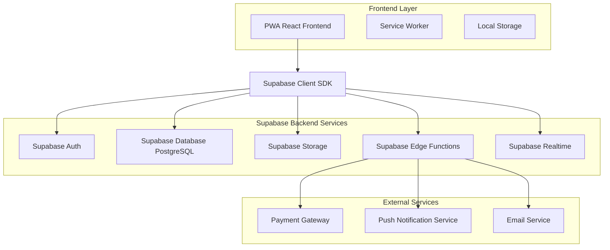

# Arquitetura Técnica - Q Delícia com Supabase

## 1. Arquitetura Geral



## 2. Stack Tecnológico

### Frontend
- **React**: 19.1.0 + TypeScript
- **Build Tool**: Vite
- **Styling**: TailwindCSS
- **State Management**: Zustand (recomendado para substituir Context API)
- **Routing**: React Router DOM v7
- **Forms**: React Hook Form + Zod
- **HTTP Client**: Supabase Client SDK
- **PWA**: Workbox

### Backend (Supabase)
- **Database**: PostgreSQL 15+
- **Auth**: Supabase Auth (JWT)
- **Storage**: Supabase Storage
- **Functions**: Deno Edge Functions
- **Realtime**: WebSockets

### Integrações
- **Pagamentos**: Mercado Pago / PagSeguro
- **Notificações**: Firebase Cloud Messaging
- **Email**: Resend / SendGrid
- **Analytics**: Supabase Analytics

## 3. Definições de Rotas

| Rota | Propósito | Autenticação |
|------|-----------|-------------|
| `/` | Página inicial com produtos em destaque | Não |
| `/produtos` | Catálogo completo de produtos | Não |
| `/produto/:id` | Detalhes do produto | Não |
| `/carrinho` | Carrinho de compras | Não |
| `/login` | Autenticação de usuário | Não |
| `/registro` | Cadastro de novo usuário | Não |
| `/checkout` | Finalização do pedido | Sim |
| `/pedidos` | Histórico de pedidos do usuário | Sim |
| `/pedido/:id` | Detalhes de um pedido específico | Sim |
| `/reservas` | Sistema de reservas | Sim |
| `/perfil` | Dados do usuário | Sim |
| `/admin` | Painel administrativo | Admin |
| `/admin/pedidos` | Gestão de pedidos | Admin |
| `/admin/produtos` | Gestão de produtos | Admin |
| `/admin/reservas` | Gestão de reservas | Admin |
| `/admin/dashboard` | Dashboard com métricas | Admin |

## 4. APIs e Integrações

### 4.1 Supabase Client Configuration

```typescript
// src/lib/supabase.ts
import { createClient } from '@supabase/supabase-js'
import { Database } from './database.types'

const supabaseUrl = process.env.VITE_SUPABASE_URL!
const supabaseAnonKey = process.env.VITE_SUPABASE_ANON_KEY!

export const supabase = createClient<Database>(supabaseUrl, supabaseAnonKey, {
  auth: {
    autoRefreshToken: true,
    persistSession: true,
    detectSessionInUrl: true
  },
  realtime: {
    params: {
      eventsPerSecond: 10
    }
  }
})
```

### 4.2 Serviços de Autenticação

```typescript
// src/services/auth.service.ts
export class AuthService {
  static async signUp(email: string, password: string, userData: UserData) {
    const { data, error } = await supabase.auth.signUp({
      email,
      password,
      options: {
        data: userData
      }
    })
    return { data, error }
  }

  static async signIn(email: string, password: string) {
    const { data, error } = await supabase.auth.signInWithPassword({
      email,
      password
    })
    return { data, error }
  }

  static async signOut() {
    const { error } = await supabase.auth.signOut()
    return { error }
  }

  static async resetPassword(email: string) {
    const { data, error } = await supabase.auth.resetPasswordForEmail(email)
    return { data, error }
  }
}
```

### 4.3 Serviços de Produtos

```typescript
// src/services/products.service.ts
export class ProductsService {
  static async getProducts(category?: string) {
    let query = supabase
      .from('products')
      .select('*')
      .eq('available', true)
      .order('name')
    
    if (category) {
      query = query.eq('category', category)
    }
    
    const { data, error } = await query
    return { data, error }
  }

  static async getProductById(id: string) {
    const { data, error } = await supabase
      .from('products')
      .select('*')
      .eq('id', id)
      .single()
    
    return { data, error }
  }

  static async updateStock(id: string, stock: string) {
    const { data, error } = await supabase
      .from('products')
      .update({ stock, updated_at: new Date().toISOString() })
      .eq('id', id)
      .select()
    
    return { data, error }
  }
}
```

### 4.4 Serviços de Pedidos

```typescript
// src/services/orders.service.ts
export class OrdersService {
  static async createOrder(orderData: CreateOrderData) {
    const { data: order, error: orderError } = await supabase
      .from('orders')
      .insert(orderData)
      .select()
      .single()
    
    if (orderError) return { data: null, error: orderError }
    
    const { data: items, error: itemsError } = await supabase
      .from('order_items')
      .insert(
        orderData.items.map(item => ({
          order_id: order.id,
          product_id: item.product_id,
          quantity: item.quantity,
          unit_price: item.unit_price,
          subtotal: item.subtotal
        }))
      )
    
    return { data: { order, items }, error: itemsError }
  }

  static async getOrdersByUser(userId: string) {
    const { data, error } = await supabase
      .from('orders')
      .select(`
        *,
        order_items (
          *,
          products (*)
        )
      `)
      .eq('user_id', userId)
      .order('created_at', { ascending: false })
    
    return { data, error }
  }

  static async updateOrderStatus(orderId: string, status: string) {
    const { data, error } = await supabase
      .from('orders')
      .update({ status, updated_at: new Date().toISOString() })
      .eq('id', orderId)
      .select()
    
    return { data, error }
  }
}
```

## 5. Arquitetura do Servidor (Edge Functions)

### 5.1 Estrutura de Edge Functions

```
supabase/functions/
├── process-payment/
│   └── index.ts
├── send-notification/
│   └── index.ts
├── generate-qr-code/
│   └── index.ts
├── update-order-status/
│   └── index.ts
└── _shared/
    ├── cors.ts
    ├── auth.ts
    └── types.ts
```

### 5.2 Processamento de Pagamentos

```typescript
// supabase/functions/process-payment/index.ts
import { serve } from 'https://deno.land/std@0.168.0/http/server.ts'
import { createClient } from 'https://esm.sh/@supabase/supabase-js@2'

serve(async (req) => {
  const { orderId, paymentMethod, paymentData } = await req.json()
  
  try {
    // Processar pagamento com gateway
    const paymentResult = await processPaymentWithGateway(paymentMethod, paymentData)
    
    if (paymentResult.success) {
      // Atualizar status do pedido
      await supabase
        .from('orders')
        .update({ 
          status: 'paid',
          payment_id: paymentResult.transactionId 
        })
        .eq('id', orderId)
      
      // Enviar notificação
      await sendNotification(orderId, 'payment_confirmed')
    }
    
    return new Response(JSON.stringify(paymentResult), {
      headers: { 'Content-Type': 'application/json' }
    })
  } catch (error) {
    return new Response(JSON.stringify({ error: error.message }), {
      status: 500,
      headers: { 'Content-Type': 'application/json' }
    })
  }
})
```

### 5.3 Sistema de Notificações

```typescript
// supabase/functions/send-notification/index.ts
serve(async (req) => {
  const { userId, type, data } = await req.json()
  
  const templates = {
    order_confirmed: {
      title: 'Pedido Confirmado!',
      body: `Seu pedido #${data.orderId} foi confirmado e será preparado.`
    },
    order_ready: {
      title: 'Pedido Pronto!',
      body: `Seu pedido #${data.orderId} está pronto para retirada.`
    },
    payment_confirmed: {
      title: 'Pagamento Confirmado!',
      body: `Pagamento do pedido #${data.orderId} foi processado com sucesso.`
    }
  }
  
  const notification = templates[type]
  
  // Enviar push notification
  await sendPushNotification(userId, notification)
  
  // Salvar no banco para histórico
  await supabase
    .from('notifications')
    .insert({
      user_id: userId,
      type,
      title: notification.title,
      body: notification.body,
      data
    })
  
  return new Response(JSON.stringify({ success: true }))
})
```

## 6. Modelo de Dados Detalhado

### 6.1 Schema Completo

```sql
-- Enable necessary extensions
CREATE EXTENSION IF NOT EXISTS "uuid-ossp";
CREATE EXTENSION IF NOT EXISTS "pg_cron";

-- Profiles table (extends auth.users)
CREATE TABLE profiles (
    id UUID REFERENCES auth.users(id) ON DELETE CASCADE PRIMARY KEY,
    name TEXT NOT NULL,
    phone TEXT,
    role TEXT DEFAULT 'customer' CHECK (role IN ('customer', 'admin')),
    avatar_url TEXT,
    preferences JSONB DEFAULT '{}',
    created_at TIMESTAMP WITH TIME ZONE DEFAULT NOW(),
    updated_at TIMESTAMP WITH TIME ZONE DEFAULT NOW()
);

-- Products table
CREATE TABLE products (
    id UUID PRIMARY KEY DEFAULT gen_random_uuid(),
    name TEXT NOT NULL,
    description TEXT,
    price DECIMAL(10,2) NOT NULL CHECK (price > 0),
    category TEXT NOT NULL CHECK (category IN ('frango', 'churrasco', 'adicional', 'bolo-doce')),
    type TEXT,
    unit TEXT NOT NULL CHECK (unit IN ('unidade', 'porção', 'kg')),
    serves INTEGER,
    available BOOLEAN DEFAULT true,
    stock TEXT DEFAULT 'disponível' CHECK (stock IN ('disponível', 'poucos-restantes', 'esgotado')),
    image_url TEXT,
    ingredients TEXT[],
    allergens TEXT[],
    nutritional_info JSONB,
    preparation_time INTEGER, -- em minutos
    created_at TIMESTAMP WITH TIME ZONE DEFAULT NOW(),
    updated_at TIMESTAMP WITH TIME ZONE DEFAULT NOW()
);

-- Orders table
CREATE TABLE orders (
    id UUID PRIMARY KEY DEFAULT gen_random_uuid(),
    order_number TEXT UNIQUE NOT NULL,
    user_id UUID REFERENCES profiles(id),
    total DECIMAL(10,2) NOT NULL CHECK (total > 0),
    pickup_time TIMESTAMP WITH TIME ZONE NOT NULL,
    status TEXT DEFAULT 'pending' CHECK (status IN ('pending', 'paid', 'preparing', 'ready', 'completed', 'cancelled')),
    payment_method TEXT CHECK (payment_method IN ('pix', 'card', 'cash')),
    payment_id TEXT,
    payment_status TEXT DEFAULT 'pending' CHECK (payment_status IN ('pending', 'processing', 'completed', 'failed', 'refunded')),
    customer_name TEXT NOT NULL,
    customer_email TEXT NOT NULL,
    customer_phone TEXT NOT NULL,
    notes TEXT,
    estimated_preparation_time INTEGER, -- em minutos
    created_at TIMESTAMP WITH TIME ZONE DEFAULT NOW(),
    updated_at TIMESTAMP WITH TIME ZONE DEFAULT NOW()
);

-- Order items table
CREATE TABLE order_items (
    id UUID PRIMARY KEY DEFAULT gen_random_uuid(),
    order_id UUID REFERENCES orders(id) ON DELETE CASCADE,
    product_id UUID REFERENCES products(id),
    quantity INTEGER NOT NULL CHECK (quantity > 0),
    unit_price DECIMAL(10,2) NOT NULL CHECK (unit_price > 0),
    subtotal DECIMAL(10,2) NOT NULL CHECK (subtotal > 0),
    special_instructions TEXT,
    created_at TIMESTAMP WITH TIME ZONE DEFAULT NOW()
);

-- Reservations table
CREATE TABLE reservations (
    id UUID PRIMARY KEY DEFAULT gen_random_uuid(),
    reservation_number TEXT UNIQUE NOT NULL,
    user_id UUID REFERENCES profiles(id),
    name TEXT NOT NULL,
    phone TEXT NOT NULL,
    email TEXT NOT NULL,
    reservation_date DATE NOT NULL,
    reservation_time TIME NOT NULL,
    guests INTEGER NOT NULL CHECK (guests > 0),
    type TEXT NOT NULL CHECK (type IN ('corporativo', 'familiar')),
    status TEXT DEFAULT 'pending' CHECK (status IN ('pending', 'confirmed', 'cancelled', 'completed')),
    notes TEXT,
    special_requests TEXT,
    created_at TIMESTAMP WITH TIME ZONE DEFAULT NOW(),
    updated_at TIMESTAMP WITH TIME ZONE DEFAULT NOW()
);

-- Time slots table
CREATE TABLE time_slots (
    id UUID PRIMARY KEY DEFAULT gen_random_uuid(),
    date DATE NOT NULL,
    time TIME NOT NULL,
    capacity INTEGER NOT NULL DEFAULT 10 CHECK (capacity > 0),
    booked INTEGER NOT NULL DEFAULT 0 CHECK (booked >= 0),
    available BOOLEAN GENERATED ALWAYS AS (booked < capacity) STORED,
    created_at TIMESTAMP WITH TIME ZONE DEFAULT NOW(),
    UNIQUE(date, time)
);

-- Notifications table
CREATE TABLE notifications (
    id UUID PRIMARY KEY DEFAULT gen_random_uuid(),
    user_id UUID REFERENCES profiles(id) ON DELETE CASCADE,
    type TEXT NOT NULL,
    title TEXT NOT NULL,
    body TEXT NOT NULL,
    data JSONB DEFAULT '{}',
    read BOOLEAN DEFAULT false,
    created_at TIMESTAMP WITH TIME ZONE DEFAULT NOW()
);

-- Cart items table (for persistent cart)
CREATE TABLE cart_items (
    id UUID PRIMARY KEY DEFAULT gen_random_uuid(),
    user_id UUID REFERENCES profiles(id) ON DELETE CASCADE,
    product_id UUID REFERENCES products(id) ON DELETE CASCADE,
    quantity INTEGER NOT NULL CHECK (quantity > 0),
    created_at TIMESTAMP WITH TIME ZONE DEFAULT NOW(),
    updated_at TIMESTAMP WITH TIME ZONE DEFAULT NOW(),
    UNIQUE(user_id, product_id)
);
```

### 6.2 Índices para Performance

```sql
-- Índices para otimização de queries
CREATE INDEX idx_products_category ON products(category);
CREATE INDEX idx_products_available ON products(available);
CREATE INDEX idx_orders_user_id ON orders(user_id);
CREATE INDEX idx_orders_status ON orders(status);
CREATE INDEX idx_orders_pickup_time ON orders(pickup_time);
CREATE INDEX idx_order_items_order_id ON order_items(order_id);
CREATE INDEX idx_reservations_date ON reservations(reservation_date);
CREATE INDEX idx_reservations_status ON reservations(status);
CREATE INDEX idx_time_slots_date ON time_slots(date);
CREATE INDEX idx_notifications_user_id ON notifications(user_id);
CREATE INDEX idx_cart_items_user_id ON cart_items(user_id);
```

### 6.3 Triggers e Functions

```sql
-- Function para gerar número do pedido
CREATE OR REPLACE FUNCTION generate_order_number()
RETURNS TEXT AS $$
BEGIN
    RETURN 'PD' || TO_CHAR(NOW(), 'YYYYMMDD') || LPAD(NEXTVAL('order_sequence')::TEXT, 4, '0');
END;
$$ LANGUAGE plpgsql;

-- Sequence para números de pedido
CREATE SEQUENCE IF NOT EXISTS order_sequence START 1;

-- Trigger para auto-gerar número do pedido
CREATE OR REPLACE FUNCTION set_order_number()
RETURNS TRIGGER AS $$
BEGIN
    IF NEW.order_number IS NULL THEN
        NEW.order_number := generate_order_number();
    END IF;
    RETURN NEW;
END;
$$ LANGUAGE plpgsql;

CREATE TRIGGER trigger_set_order_number
    BEFORE INSERT ON orders
    FOR EACH ROW
    EXECUTE FUNCTION set_order_number();

-- Function para atualizar updated_at
CREATE OR REPLACE FUNCTION update_updated_at_column()
RETURNS TRIGGER AS $$
BEGIN
    NEW.updated_at = NOW();
    RETURN NEW;
END;
$$ LANGUAGE plpgsql;

-- Triggers para updated_at
CREATE TRIGGER update_profiles_updated_at
    BEFORE UPDATE ON profiles
    FOR EACH ROW
    EXECUTE FUNCTION update_updated_at_column();

CREATE TRIGGER update_products_updated_at
    BEFORE UPDATE ON products
    FOR EACH ROW
    EXECUTE FUNCTION update_updated_at_column();

CREATE TRIGGER update_orders_updated_at
    BEFORE UPDATE ON orders
    FOR EACH ROW
    EXECUTE FUNCTION update_updated_at_column();
```

## 7. Configuração de Segurança (RLS)

### 7.1 Políticas Row Level Security

```sql
-- Enable RLS on all tables
ALTER TABLE profiles ENABLE ROW LEVEL SECURITY;
ALTER TABLE products ENABLE ROW LEVEL SECURITY;
ALTER TABLE orders ENABLE ROW LEVEL SECURITY;
ALTER TABLE order_items ENABLE ROW LEVEL SECURITY;
ALTER TABLE reservations ENABLE ROW LEVEL SECURITY;
ALTER TABLE notifications ENABLE ROW LEVEL SECURITY;
ALTER TABLE cart_items ENABLE ROW LEVEL SECURITY;

-- Profiles policies
CREATE POLICY "Users can view own profile" ON profiles
    FOR SELECT USING (auth.uid() = id);

CREATE POLICY "Users can update own profile" ON profiles
    FOR UPDATE USING (auth.uid() = id);

CREATE POLICY "Users can insert own profile" ON profiles
    FOR INSERT WITH CHECK (auth.uid() = id);

-- Products policies
CREATE POLICY "Anyone can view available products" ON products
    FOR SELECT USING (available = true);

CREATE POLICY "Admins can view all products" ON products
    FOR SELECT USING (
        EXISTS (
            SELECT 1 FROM profiles 
            WHERE id = auth.uid() AND role = 'admin'
        )
    );

CREATE POLICY "Only admins can modify products" ON products
    FOR ALL USING (
        EXISTS (
            SELECT 1 FROM profiles 
            WHERE id = auth.uid() AND role = 'admin'
        )
    );

-- Orders policies
CREATE POLICY "Users can view own orders" ON orders
    FOR SELECT USING (
        auth.uid() = user_id OR 
        EXISTS (
            SELECT 1 FROM profiles 
            WHERE id = auth.uid() AND role = 'admin'
        )
    );

CREATE POLICY "Users can create orders" ON orders
    FOR INSERT WITH CHECK (auth.uid() = user_id);

CREATE POLICY "Admins can update orders" ON orders
    FOR UPDATE USING (
        EXISTS (
            SELECT 1 FROM profiles 
            WHERE id = auth.uid() AND role = 'admin'
        )
    );

-- Order items policies
CREATE POLICY "Users can view own order items" ON order_items
    FOR SELECT USING (
        EXISTS (
            SELECT 1 FROM orders 
            WHERE id = order_items.order_id 
            AND (user_id = auth.uid() OR EXISTS (
                SELECT 1 FROM profiles 
                WHERE id = auth.uid() AND role = 'admin'
            ))
        )
    );

-- Cart items policies
CREATE POLICY "Users can manage own cart" ON cart_items
    FOR ALL USING (auth.uid() = user_id);

-- Notifications policies
CREATE POLICY "Users can view own notifications" ON notifications
    FOR SELECT USING (auth.uid() = user_id);

CREATE POLICY "Users can update own notifications" ON notifications
    FOR UPDATE USING (auth.uid() = user_id);
```

## 8. Configuração de Ambiente

### 8.1 Variáveis de Ambiente

```bash
# .env.example

# Supabase Configuration
VITE_SUPABASE_URL=your_supabase_project_url
VITE_SUPABASE_ANON_KEY=your_supabase_anon_key

# App Configuration
VITE_APP_NAME="Q Delícia"
VITE_APP_VERSION=1.0.0
VITE_APP_ENVIRONMENT=development

# Business Configuration
VITE_STORE_ADDRESS="R. Carlos Barbosa, 1967 - Vila Industrial, Toledo - PR"
VITE_STORE_PHONE="(45) 99999-9999"
VITE_STORE_EMAIL="contato@qdelicia.com.br"

# Payment Configuration
VITE_MERCADOPAGO_PUBLIC_KEY=your_mercadopago_public_key
VITE_PAGSEGURO_PUBLIC_KEY=your_pagseguro_public_key

# Analytics
VITE_GOOGLE_ANALYTICS_ID=your_ga_id

# PWA Configuration
VITE_PWA_NAME="Q Delícia"
VITE_PWA_SHORT_NAME="Q Delícia"
VITE_PWA_DESCRIPTION="Delivery de Panificadora"
VITE_PWA_THEME_COLOR="#8B4513"

# Development
VITE_DEV_MODE=true
VITE_MOCK_PAYMENTS=true
```

### 8.2 Configuração do Supabase

```typescript
// src/lib/supabase.ts
import { createClient } from '@supabase/supabase-js'
import { Database } from './database.types'

const supabaseUrl = import.meta.env.VITE_SUPABASE_URL
const supabaseAnonKey = import.meta.env.VITE_SUPABASE_ANON_KEY

if (!supabaseUrl || !supabaseAnonKey) {
  throw new Error('Missing Supabase environment variables')
}

export const supabase = createClient<Database>(supabaseUrl, supabaseAnonKey, {
  auth: {
    autoRefreshToken: true,
    persistSession: true,
    detectSessionInUrl: true,
    flowType: 'pkce'
  },
  realtime: {
    params: {
      eventsPerSecond: 10
    }
  },
  global: {
    headers: {
      'X-Client-Info': `q-delicia-pwa@${import.meta.env.VITE_APP_VERSION}`
    }
  }
})

// Types
export type Tables<T extends keyof Database['public']['Tables']> = Database['public']['Tables'][T]['Row']
export type Enums<T extends keyof Database['public']['Enums']> = Database['public']['Enums'][T]
```

---

## Resumo da Arquitetura

Esta arquitetura técnica fornece uma base sólida para a evolução do Q Delícia, aproveitando as capacidades completas do Supabase para criar uma aplicação moderna, escalável e segura. A estrutura modular permite desenvolvimento incremental e manutenção facilitada, enquanto as políticas de segurança garantem proteção adequada dos dados dos usuários.

A implementação seguindo esta arquitetura resultará em uma aplicação robusta, pronta para produção e preparada para crescimento futuro.