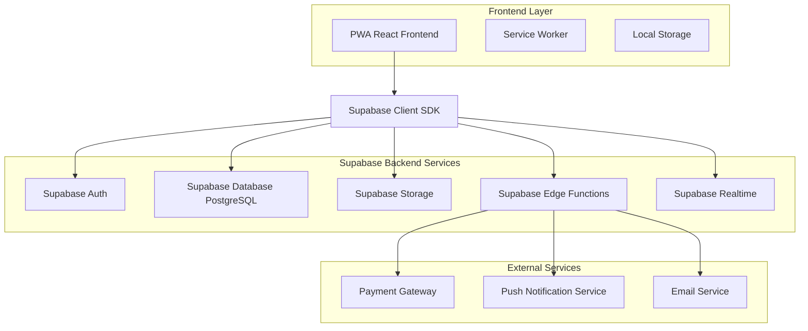

# Estrutura Técnica Completa - Q Delícia

## 📋 Índice

1. [Análise Técnica Profunda](#1-análise-técnica-profunda)
2. [Arquitetura Geral](#2-arquitetura-geral)
3. [Modelo de Dados Supabase](#3-modelo-de-dados-supabase)
4. [Plano de Implementação](#4-plano-de-implementação)
5. [Stack Tecnológico](#5-stack-tecnológico)
6. [Configurações e Integrações](#6-configurações-e-integrações)
7. [Segurança e Performance](#7-segurança-e-performance)
8. [Cronograma e Recursos](#8-cronograma-e-recursos)

---

# 1. Análise Técnica Profunda

## 1.1 Visão Geral do Projeto

O **Q Delícia** é um Progressive Web App (PWA) desenvolvido em React + TypeScript para delivery de uma panificadora especializada em frangos assados e churrascos. O projeto atual possui uma arquitetura frontend robusta com dados mockados, pronto para evolução para um sistema completo com backend.

### Características Atuais
- **Frontend**: React 19.1.0 + TypeScript + Vite
- **Styling**: TailwindCSS com tema customizado
- **Estado**: Context API com useReducer
- **Dados**: Completamente mockados com Faker.js
- **Funcionalidades**: Sistema completo de pedidos, carrinho, agendamento, pagamento e painel administrativo

## 1.2 Análise da Arquitetura Atual

### Pontos Fortes

#### Estrutura Bem Organizada
```
src/
├── components/          # Componentes organizados por domínio
│   ├── Admin/          # Painel administrativo
│   ├── Common/         # Componentes reutilizáveis
│   ├── Layout/         # Layout e navegação
│   └── Views/          # Páginas principais
├── context/            # Gerenciamento de estado global
├── data/              # Dados mockados
├── types/             # Definições TypeScript
└── config.ts          # Configurações da aplicação
```

#### Gerenciamento de Estado Eficiente
- Context API bem estruturado com actions tipadas
- Estado centralizado para carrinho, usuário, pedidos e reservas
- Reducer pattern para operações complexas

#### Tipagem Completa
- Interfaces bem definidas para Product, Order, User, Reservation
- Tipos específicos para diferentes categorias de produtos
- Enums para status e estados

#### Funcionalidades Implementadas
1. **Sistema de Produtos**: Frangos, churrascos, adicionais, bolos
2. **Carrinho de Compras**: Adicionar, remover, atualizar quantidades
3. **Agendamento**: Horários de retirada com validação
4. **Sistema de Pagamento**: PIX e cartão (mockado)
5. **Reservas**: Sistema para eventos corporativos e familiares
6. **Painel Admin**: Dashboard, pedidos, reservas
7. **Autenticação**: Login básico com diferentes níveis de acesso

### Pontos de Melhoria

#### Limitações Atuais
1. **Dados Temporários**: Tudo em memória, perdido ao recarregar
2. **Sem Persistência**: Carrinho e estado não persistem
3. **Autenticação Simulada**: Login sem validação real
4. **Pagamentos Mockados**: Sem integração real
5. **Sem Notificações**: Push notifications ausentes
6. **Sem Sincronização**: Dados não sincronizam entre dispositivos

#### Oportunidades de Refatoração
1. **App.tsx (241 linhas)**: Muito extenso, precisa ser modularizado
2. **Navegação**: Implementar React Router para URLs amigáveis
3. **Validações**: Adicionar validação robusta de formulários
4. **Error Handling**: Implementar tratamento de erros global
5. **Loading States**: Adicionar estados de carregamento

---

# 2. Arquitetura Geral

## 2.1 Diagrama de Arquitetura



## 2.2 Por que Supabase?

**Vantagens para o Q Delícia:**
- **Backend-as-a-Service**: Reduz complexidade de infraestrutura
- **PostgreSQL**: Banco relacional robusto
- **Auth Built-in**: Sistema de autenticação completo
- **Real-time**: Sincronização automática de dados
- **Storage**: Para imagens de produtos
- **Edge Functions**: Para lógica de negócio complexa
- **Mobile-First**: Otimizado para PWAs

---

# 3. Modelo de Dados Supabase

## 3.1 Schema Completo do Banco de Dados

```sql
-- Enable necessary extensions
CREATE EXTENSION IF NOT EXISTS "uuid-ossp";
CREATE EXTENSION IF NOT EXISTS "pg_cron";

-- Profiles table (extends auth.users)
CREATE TABLE profiles (
    id UUID REFERENCES auth.users(id) ON DELETE CASCADE PRIMARY KEY,
    name TEXT NOT NULL,
    phone TEXT,
    role TEXT DEFAULT 'customer' CHECK (role IN ('customer', 'admin')),
    avatar_url TEXT,
    preferences JSONB DEFAULT '{}',
    created_at TIMESTAMP WITH TIME ZONE DEFAULT NOW(),
    updated_at TIMESTAMP WITH TIME ZONE DEFAULT NOW()
);

-- Products table
CREATE TABLE products (
    id UUID PRIMARY KEY DEFAULT gen_random_uuid(),
    name TEXT NOT NULL,
    description TEXT,
    price DECIMAL(10,2) NOT NULL CHECK (price > 0),
    category TEXT NOT NULL CHECK (category IN ('frango', 'churrasco', 'adicional', 'bolo-doce')),
    type TEXT,
    unit TEXT NOT NULL CHECK (unit IN ('unidade', 'porção', 'kg')),
    serves INTEGER,
    available BOOLEAN DEFAULT true,
    stock TEXT DEFAULT 'disponível' CHECK (stock IN ('disponível', 'poucos-restantes', 'esgotado')),
    image_url TEXT,
    ingredients TEXT[],
    allergens TEXT[],
    nutritional_info JSONB,
    preparation_time INTEGER, -- em minutos
    created_at TIMESTAMP WITH TIME ZONE DEFAULT NOW(),
    updated_at TIMESTAMP WITH TIME ZONE DEFAULT NOW()
);

-- Orders table
CREATE TABLE orders (
    id UUID PRIMARY KEY DEFAULT gen_random_uuid(),
    order_number TEXT UNIQUE NOT NULL,
    user_id UUID REFERENCES profiles(id),
    total DECIMAL(10,2) NOT NULL CHECK (total > 0),
    pickup_time TIMESTAMP WITH TIME ZONE NOT NULL,
    status TEXT DEFAULT 'pending' CHECK (status IN ('pending', 'paid', 'preparing', 'ready', 'completed', 'cancelled')),
    payment_method TEXT CHECK (payment_method IN ('pix', 'card', 'cash')),
    payment_id TEXT,
    payment_status TEXT DEFAULT 'pending' CHECK (payment_status IN ('pending', 'processing', 'completed', 'failed', 'refunded')),
    customer_name TEXT NOT NULL,
    customer_email TEXT NOT NULL,
    customer_phone TEXT NOT NULL,
    notes TEXT,
    estimated_preparation_time INTEGER, -- em minutos
    created_at TIMESTAMP WITH TIME ZONE DEFAULT NOW(),
    updated_at TIMESTAMP WITH TIME ZONE DEFAULT NOW()
);

-- Order items table
CREATE TABLE order_items (
    id UUID PRIMARY KEY DEFAULT gen_random_uuid(),
    order_id UUID REFERENCES orders(id) ON DELETE CASCADE,
    product_id UUID REFERENCES products(id),
    quantity INTEGER NOT NULL CHECK (quantity > 0),
    unit_price DECIMAL(10,2) NOT NULL CHECK (unit_price > 0),
    subtotal DECIMAL(10,2) NOT NULL CHECK (subtotal > 0),
    special_instructions TEXT,
    created_at TIMESTAMP WITH TIME ZONE DEFAULT NOW()
);

-- Reservations table
CREATE TABLE reservations (
    id UUID PRIMARY KEY DEFAULT gen_random_uuid(),
    reservation_number TEXT UNIQUE NOT NULL,
    user_id UUID REFERENCES profiles(id),
    name TEXT NOT NULL,
    phone TEXT NOT NULL,
    email TEXT NOT NULL,
    reservation_date DATE NOT NULL,
    reservation_time TIME NOT NULL,
    guests INTEGER NOT NULL CHECK (guests > 0),
    type TEXT NOT NULL CHECK (type IN ('corporativo', 'familiar')),
    status TEXT DEFAULT 'pending' CHECK (status IN ('pending', 'confirmed', 'cancelled', 'completed')),
    notes TEXT,
    special_requests TEXT,
    created_at TIMESTAMP WITH TIME ZONE DEFAULT NOW(),
    updated_at TIMESTAMP WITH TIME ZONE DEFAULT NOW()
);

-- Time slots table
CREATE TABLE time_slots (
    id UUID PRIMARY KEY DEFAULT gen_random_uuid(),
    date DATE NOT NULL,
    time TIME NOT NULL,
    capacity INTEGER NOT NULL DEFAULT 10 CHECK (capacity > 0),
    booked INTEGER NOT NULL DEFAULT 0 CHECK (booked >= 0),
    available BOOLEAN GENERATED ALWAYS AS (booked < capacity) STORED,
    created_at TIMESTAMP WITH TIME ZONE DEFAULT NOW(),
    UNIQUE(date, time)
);

-- Notifications table
CREATE TABLE notifications (
    id UUID PRIMARY KEY DEFAULT gen_random_uuid(),
    user_id UUID REFERENCES profiles(id) ON DELETE CASCADE,
    type TEXT NOT NULL,
    title TEXT NOT NULL,
    body TEXT NOT NULL,
    data JSONB DEFAULT '{}',
    read BOOLEAN DEFAULT false,
    created_at TIMESTAMP WITH TIME ZONE DEFAULT NOW()
);

-- Cart items table (for persistent cart)
CREATE TABLE cart_items (
    id UUID PRIMARY KEY DEFAULT gen_random_uuid(),
    user_id UUID REFERENCES profiles(id) ON DELETE CASCADE,
    product_id UUID REFERENCES products(id) ON DELETE CASCADE,
    quantity INTEGER NOT NULL CHECK (quantity > 0),
    created_at TIMESTAMP WITH TIME ZONE DEFAULT NOW(),
    updated_at TIMESTAMP WITH TIME ZONE DEFAULT NOW(),
    UNIQUE(user_id, product_id)
);
```

## 3.2 Índices para Performance

```sql
-- Índices para otimização de queries
CREATE INDEX idx_products_category ON products(category);
CREATE INDEX idx_products_available ON products(available);
CREATE INDEX idx_orders_user_id ON orders(user_id);
CREATE INDEX idx_orders_status ON orders(status);
CREATE INDEX idx_orders_pickup_time ON orders(pickup_time);
CREATE INDEX idx_order_items_order_id ON order_items(order_id);
CREATE INDEX idx_reservations_date ON reservations(reservation_date);
CREATE INDEX idx_reservations_status ON reservations(status);
CREATE INDEX idx_time_slots_date ON time_slots(date);
CREATE INDEX idx_notifications_user_id ON notifications(user_id);
CREATE INDEX idx_cart_items_user_id ON cart_items(user_id);
```

## 3.3 Políticas de Segurança (RLS)

```sql
-- Enable RLS on all tables
ALTER TABLE profiles ENABLE ROW LEVEL SECURITY;
ALTER TABLE products ENABLE ROW LEVEL SECURITY;
ALTER TABLE orders ENABLE ROW LEVEL SECURITY;
ALTER TABLE order_items ENABLE ROW LEVEL SECURITY;
ALTER TABLE reservations ENABLE ROW LEVEL SECURITY;
ALTER TABLE notifications ENABLE ROW LEVEL SECURITY;
ALTER TABLE cart_items ENABLE ROW LEVEL SECURITY;

-- Profiles policies
CREATE POLICY "Users can view own profile" ON profiles
    FOR SELECT USING (auth.uid() = id);

CREATE POLICY "Users can update own profile" ON profiles
    FOR UPDATE USING (auth.uid() = id);

-- Products policies
CREATE POLICY "Anyone can view available products" ON products
    FOR SELECT USING (available = true);

CREATE POLICY "Only admins can modify products" ON products
    FOR ALL USING (
        EXISTS (
            SELECT 1 FROM profiles 
            WHERE id = auth.uid() AND role = 'admin'
        )
    );

-- Orders policies
CREATE POLICY "Users can view own orders" ON orders
    FOR SELECT USING (
        auth.uid() = user_id OR 
        EXISTS (
            SELECT 1 FROM profiles 
            WHERE id = auth.uid() AND role = 'admin'
        )
    );

-- Cart items policies
CREATE POLICY "Users can manage own cart" ON cart_items
    FOR ALL USING (auth.uid() = user_id);
```

---

# 4. Plano de Implementação

## Fase 1: Preparação e Configuração (1-2 semanas)

### Objetivos
- Configurar projeto Supabase
- Refatorar código atual
- Implementar estrutura base

### Tarefas
1. **Setup Supabase**
   - Criar projeto no Supabase
   - Configurar variáveis de ambiente
   - Instalar SDK do Supabase

2. **Refatoração do Frontend**
   - Modularizar App.tsx
   - Implementar React Router
   - Criar hooks customizados para Supabase
   - Adicionar tratamento de erros global

3. **Estrutura de Dados**
   - Criar tabelas no Supabase
   - Configurar políticas RLS
   - Popular dados iniciais

### Arquivos a Criar/Modificar
```
src/
├── hooks/
│   ├── useAuth.ts
│   ├── useProducts.ts
│   ├── useOrders.ts
│   └── useReservations.ts
├── services/
│   ├── supabase.ts
│   ├── auth.service.ts
│   ├── products.service.ts
│   └── orders.service.ts
├── utils/
│   ├── errorHandler.ts
│   └── validators.ts
└── .env.example
```

## Fase 2: Autenticação e Usuários (1 semana)

### Objetivos
- Implementar autenticação real
- Migrar sistema de usuários
- Configurar perfis

### Funcionalidades
1. **Login/Registro**
   - Email + senha
   - Verificação de email
   - Reset de senha

2. **Perfis de Usuário**
   - Dados pessoais
   - Histórico de pedidos
   - Preferências

3. **Autorização**
   - Roles (customer, admin)
   - Proteção de rotas
   - Middleware de autenticação

## Fase 3: Produtos e Catálogo (1 semana)

### Objetivos
- Migrar produtos para Supabase
- Implementar gestão de estoque
- Adicionar upload de imagens

### Funcionalidades
1. **Catálogo de Produtos**
   - CRUD completo
   - Categorização
   - Filtros e busca

2. **Gestão de Estoque**
   - Controle de disponibilidade
   - Alertas de estoque baixo
   - Histórico de movimentações

3. **Imagens**
   - Upload para Supabase Storage
   - Otimização automática
   - CDN integrado

## Fase 4: Carrinho e Pedidos (2 semanas)

### Objetivos
- Implementar persistência do carrinho
- Sistema completo de pedidos
- Integração com pagamentos

### Funcionalidades
1. **Carrinho Persistente**
   - Salvar no localStorage
   - Sincronizar com backend
   - Recuperação automática

2. **Sistema de Pedidos**
   - Criação de pedidos
   - Tracking de status
   - Notificações em tempo real

3. **Agendamento**
   - Horários disponíveis dinâmicos
   - Validação de capacidade
   - Bloqueio automático

## Fase 5: Pagamentos (1-2 semanas)

### Objetivos
- Integrar gateway de pagamento
- Implementar PIX e cartão
- Sistema de confirmação

### Funcionalidades
1. **PIX**
   - Geração de QR Code
   - Webhook de confirmação
   - Timeout automático

2. **Cartão de Crédito**
   - Tokenização segura
   - Processamento assíncrono
   - Retry automático

3. **Edge Functions**
   - Processamento de pagamentos
   - Webhooks seguros
   - Logs de auditoria

## Fase 6: Reservas e Admin (1 semana)

### Objetivos
- Sistema completo de reservas
- Painel administrativo funcional
- Dashboard em tempo real

### Funcionalidades
1. **Reservas**
   - Calendário interativo
   - Validação de disponibilidade
   - Confirmação automática

2. **Painel Admin**
   - Dashboard em tempo real
   - Gestão de pedidos
   - Relatórios e métricas

## Fase 7: PWA e Mobile (1 semana)

### Objetivos
- Otimizar para mobile
- Implementar PWA completo
- Push notifications

### Funcionalidades
1. **PWA**
   - Service Worker
   - Cache estratégico
   - Offline support

2. **Push Notifications**
   - Status de pedidos
   - Promoções
   - Lembretes

3. **Mobile UX**
   - Touch gestures
   - Navegação otimizada
   - Performance

---

# 5. Stack Tecnológico

## Frontend
- **React**: 19.1.0 + TypeScript
- **Build Tool**: Vite
- **Styling**: TailwindCSS
- **State Management**: Zustand (recomendado para substituir Context API)
- **Routing**: React Router DOM v7
- **Forms**: React Hook Form + Zod
- **HTTP Client**: Supabase Client SDK
- **PWA**: Workbox

## Backend (Supabase)
- **Database**: PostgreSQL 15+
- **Auth**: Supabase Auth (JWT)
- **Storage**: Supabase Storage
- **Functions**: Deno Edge Functions
- **Realtime**: WebSockets

## Integrações
- **Pagamentos**: Mercado Pago / PagSeguro
- **Notificações**: Firebase Cloud Messaging
- **Email**: Resend / SendGrid
- **Analytics**: Supabase Analytics

## Definições de Rotas

| Rota | Propósito | Autenticação |
|------|-----------|-------------|
| `/` | Página inicial com produtos em destaque | Não |
| `/produtos` | Catálogo completo de produtos | Não |
| `/produto/:id` | Detalhes do produto | Não |
| `/carrinho` | Carrinho de compras | Não |
| `/login` | Autenticação de usuário | Não |
| `/registro` | Cadastro de novo usuário | Não |
| `/checkout` | Finalização do pedido | Sim |
| `/pedidos` | Histórico de pedidos do usuário | Sim |
| `/pedido/:id` | Detalhes de um pedido específico | Sim |
| `/reservas` | Sistema de reservas | Sim |
| `/perfil` | Dados do usuário | Sim |
| `/admin` | Painel administrativo | Admin |
| `/admin/pedidos` | Gestão de pedidos | Admin |
| `/admin/produtos` | Gestão de produtos | Admin |
| `/admin/reservas` | Gestão de reservas | Admin |
| `/admin/dashboard` | Dashboard com métricas | Admin |

---

# 6. Configurações e Integrações

## 6.1 Variáveis de Ambiente

```bash
# .env.example

# Supabase Configuration
VITE_SUPABASE_URL=your_supabase_project_url
VITE_SUPABASE_ANON_KEY=your_supabase_anon_key

# App Configuration
VITE_APP_NAME="Q Delícia"
VITE_APP_VERSION=1.0.0
VITE_APP_ENVIRONMENT=development

# Business Configuration
VITE_STORE_ADDRESS="R. Carlos Barbosa, 1967 - Vila Industrial, Toledo - PR"
VITE_STORE_PHONE="(45) 99999-9999"
VITE_STORE_EMAIL="contato@qdelicia.com.br"

# Payment Configuration
VITE_MERCADOPAGO_PUBLIC_KEY=your_mercadopago_public_key
VITE_PAGSEGURO_PUBLIC_KEY=your_pagseguro_public_key

# Analytics
VITE_GOOGLE_ANALYTICS_ID=your_ga_id

# PWA Configuration
VITE_PWA_NAME="Q Delícia"
VITE_PWA_SHORT_NAME="Q Delícia"
VITE_PWA_DESCRIPTION="Delivery de Panificadora"
VITE_PWA_THEME_COLOR="#8B4513"

# Development
VITE_DEV_MODE=true
VITE_MOCK_PAYMENTS=true
```

## 6.2 Configuração do Supabase

```typescript
// src/lib/supabase.ts
import { createClient } from '@supabase/supabase-js'
import { Database } from './database.types'

const supabaseUrl = import.meta.env.VITE_SUPABASE_URL
const supabaseAnonKey = import.meta.env.VITE_SUPABASE_ANON_KEY

if (!supabaseUrl || !supabaseAnonKey) {
  throw new Error('Missing Supabase environment variables')
}

export const supabase = createClient<Database>(supabaseUrl, supabaseAnonKey, {
  auth: {
    autoRefreshToken: true,
    persistSession: true,
    detectSessionInUrl: true,
    flowType: 'pkce'
  },
  realtime: {
    params: {
      eventsPerSecond: 10
    }
  },
  global: {
    headers: {
      'X-Client-Info': `q-delicia-pwa@${import.meta.env.VITE_APP_VERSION}`
    }
  }
})
```

## 6.3 Serviços de Integração

### Autenticação
```typescript
// src/services/auth.service.ts
export class AuthService {
  static async signUp(email: string, password: string, userData: UserData) {
    const { data, error } = await supabase.auth.signUp({
      email,
      password,
      options: {
        data: userData
      }
    })
    return { data, error }
  }

  static async signIn(email: string, password: string) {
    const { data, error } = await supabase.auth.signInWithPassword({
      email,
      password
    })
    return { data, error }
  }
}
```

### Produtos
```typescript
// src/services/products.service.ts
export class ProductsService {
  static async getProducts(category?: string) {
    let query = supabase
      .from('products')
      .select('*')
      .eq('available', true)
      .order('name')
    
    if (category) {
      query = query.eq('category', category)
    }
    
    const { data, error } = await query
    return { data, error }
  }
}
```

### Pedidos
```typescript
// src/services/orders.service.ts
export class OrdersService {
  static async createOrder(orderData: CreateOrderData) {
    const { data: order, error: orderError } = await supabase
      .from('orders')
      .insert(orderData)
      .select()
      .single()
    
    if (orderError) return { data: null, error: orderError }
    
    const { data: items, error: itemsError } = await supabase
      .from('order_items')
      .insert(
        orderData.items.map(item => ({
          order_id: order.id,
          product_id: item.product_id,
          quantity: item.quantity,
          unit_price: item.unit_price,
          subtotal: item.subtotal
        }))
      )
    
    return { data: { order, items }, error: itemsError }
  }
}
```

---

# 7. Segurança e Performance

## 7.1 Considerações de Segurança

### Autenticação e Autorização
- **JWT Tokens**: Gerenciados pelo Supabase
- **Row Level Security**: Políticas granulares
- **Rate Limiting**: Proteção contra ataques
- **CORS**: Configuração restritiva

### Dados Sensíveis
- **PII**: Criptografia em trânsito e repouso
- **Pagamentos**: Tokenização obrigatória
- **Logs**: Sem dados sensíveis
- **Backup**: Criptografado e versionado

### Validação
- **Input Sanitization**: Todas as entradas
- **SQL Injection**: Prevenção automática
- **XSS**: Content Security Policy
- **CSRF**: Tokens de proteção

## 7.2 Escalabilidade e Performance

### Database
- **Indexação**: Queries otimizadas
- **Connection Pooling**: Gerenciado pelo Supabase
- **Read Replicas**: Para consultas pesadas
- **Partitioning**: Para tabelas grandes

### Frontend
- **Code Splitting**: Lazy loading
- **Image Optimization**: WebP + CDN
- **Caching**: Service Worker + Browser
- **Bundle Size**: Tree shaking

### Real-time
- **WebSockets**: Supabase Realtime
- **Selective Subscriptions**: Apenas dados necessários
- **Debouncing**: Evitar updates excessivos
- **Offline Sync**: Queue de operações

## 7.3 Monitoramento e Analytics

### Métricas de Negócio
- **Conversão**: Carrinho → Pedido
- **Ticket Médio**: Valor por pedido
- **Retenção**: Usuários recorrentes
- **Satisfação**: NPS integrado

### Métricas Técnicas
- **Performance**: Core Web Vitals
- **Errors**: Sentry integration
- **Uptime**: Monitoring 24/7
- **Database**: Query performance

---

# 8. Cronograma e Recursos

## 8.1 Timeline Total: 8-10 semanas

| Fase | Duração | Desenvolvedor | QA | DevOps |
|------|---------|---------------|----|--------|
| 1 | 2 sem | 1 Senior | - | 0.5 |
| 2 | 1 sem | 1 Senior | 0.5 | - |
| 3 | 1 sem | 1 Senior | 0.5 | - |
| 4 | 2 sem | 1 Senior | 1 | - |
| 5 | 2 sem | 1 Senior + 1 Mid | 1 | 0.5 |
| 6 | 1 sem | 1 Senior | 0.5 | - |
| 7 | 1 sem | 1 Senior | 1 | 0.5 |

## 8.2 Custos Estimados (Supabase)
- **Desenvolvimento**: Plano gratuito
- **Produção**: ~$25/mês (Pro Plan)
- **Escala**: ~$100/mês (Team Plan)

## 8.3 Riscos e Mitigações

### Riscos Técnicos
| Risco | Probabilidade | Impacto | Mitigação |
|-------|---------------|---------|----------|
| Migração de dados | Baixa | Alto | Backup completo + rollback |
| Performance | Média | Médio | Load testing + otimização |
| Integração pagamento | Média | Alto | Sandbox + testes extensivos |
| Supabase downtime | Baixa | Alto | Cache local + retry logic |

### Riscos de Negócio
| Risco | Probabilidade | Impacto | Mitigação |
|-------|---------------|---------|----------|
| Resistência usuários | Baixa | Médio | UX familiar + treinamento |
| Concorrência | Alta | Médio | Features diferenciadas |
| Sazonalidade | Alta | Baixo | Promoções + diversificação |

## 8.4 Próximos Passos Recomendados

### Imediatos (Esta Semana)
1. **Criar projeto Supabase**
2. **Configurar repositório Git** com branches de desenvolvimento
3. **Definir ambiente de desenvolvimento** local
4. **Criar .env.example** com todas as variáveis necessárias

### Curto Prazo (Próximas 2 semanas)
1. **Refatorar App.tsx** em módulos menores
2. **Implementar React Router** para navegação
3. **Criar hooks customizados** para Supabase
4. **Configurar CI/CD** básico

### Médio Prazo (1-2 meses)
1. **Implementar todas as fases** do plano
2. **Testes de carga** e otimização
3. **Deploy em produção** com monitoramento
4. **Treinamento da equipe** de suporte

---

## 🎯 Conclusão

O projeto Q Delícia possui uma base sólida e bem estruturada, pronta para evolução. A migração para Supabase permitirá transformar o protótipo em uma aplicação robusta, escalável e pronta para produção. 

O plano proposto minimiza riscos através de implementação incremental, mantendo a aplicação funcional durante todo o processo. A arquitetura proposta aproveita os pontos fortes do código atual enquanto resolve suas limitações, resultando em uma solução moderna, segura e preparada para crescimento futuro.

**Esta estrutura técnica fornece uma base sólida para a evolução do Q Delícia, aproveitando as capacidades completas do Supabase para criar uma aplicação moderna, escalável e segura.**

---

*Documento criado em: Janeiro 2025*  
*Versão: 1.0*  
*Status: Pronto para implementação*